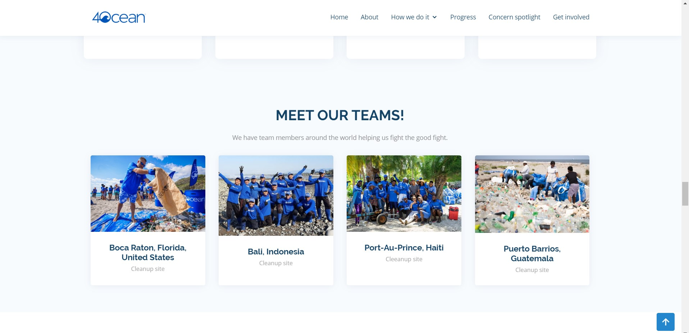

# trash-tracker-progress
​Trash tracker is a web based app built as an internship assignment during my tenure at 4Ocean.  The basis of 4Ocean is that each product sale results in 4Ocean pulling a pound (or more, depending on product purchased) of pollution from the ocean. This app allows consumers to view the intricacies of the pound for purchase model, in detail. It provides a step by step guide with insight into the product development cycle, ocean facts and tips for reducing plastic consumption.
## Table of contents
* [General info](#general-info)
* [Screenshots](#screenshots)
* [Technologies](#technologies)
* [Demo](#demo)
* [Features](#features)
* [Status](#status)
* [Inspiration](#inspiration)
* [Contact](#contact)
​
## General info
 Trash tracker is a web based app built as an internship assignment during my tenure at 4Ocean.  The basis of 4Ocean is that each product sale results in 4Ocean pulling a pound (or more, depending on product purchased) of pollution from the ocean. This app allows consumers to view the intricacies of the pound for purchase model, in detail. It provides a step by step guide with insight into the product development cycle, ocean facts and tips for reducing plastic consumption.
​
## Screenshots

​
## Technologies
* [Node](https://nodejs.org) 
* [Bootstrap](https://www.bootstrap.com/)  
* [HTML]
* [CSS]
* [Javascript](https://www.javascript.com/)

​
## Demo

#Demo Clone this repository then open the index file on your local machine OR download the ZIP file, extract all then open index file in default browser
​

## Features
List of features ready and TODOs for future development
* View amount of trash pulled by location site over time
* Infographics and statistics on ocean pollution
* Tips for reducing plastic consumption
* Current literature on major concerns for ocean health
​

To-do list:
* Add in more progress page functionality 

​
## Status
Project is: Complete
​
## Inspiration
Project inspired by conservationists everywhere, and their tireless efforts to protect the world's oceans.
​
## Contact
Created by [@tlacy1000](https://www.lacytammy.com/) - feel free to contact me!
